# MoneyMap AI: ReImagined

> **Version 1.0.0 — First Release**

An AI-powered financial copilot rebuilt from my original **MoneyMap AI** final-year project, combining live market intelligence, offline financial statement analysis, deterministic financial metrics, and multi-model AI inference in a modular Streamlit application.

<p align="center">
  
  
  
  
  
  
  
</p>

---

## 📸 Product Overview

<p align="center">
  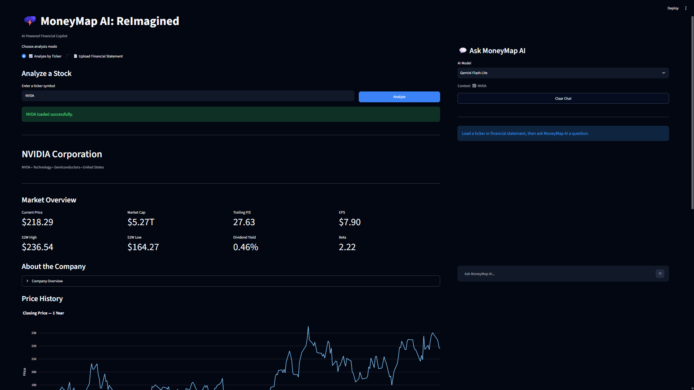
</p>

MoneyMap AI: ReImagined is the **re-engineered continuation** of my original MoneyMap AI final-year project.

The original project established the core financial-analysis concept. This release rebuilds it with a modular architecture, a permanent AI copilot, live ticker analysis, offline statement parsing, deterministic financial calculations, cloud/local model routing, and a dedicated benchmark suite.

---

## ✨ Features

### 📈 Live Ticker Analysis

Enter a public-market ticker such as:

```text
NVDA
AAPL
MSFT
TSLA
IRCTC.NS
TCS.NS
```

The ticker engine retrieves:

- Company profile
- Sector and industry
- Country and currency
- Current price
- Market capitalization
- Trailing / forward P/E
- EPS
- Dividend yield
- Beta
- 52-week high / low
- One-year historical price data
- Balance sheet
- Income statement
- Cash flow statement

<p align="center">
  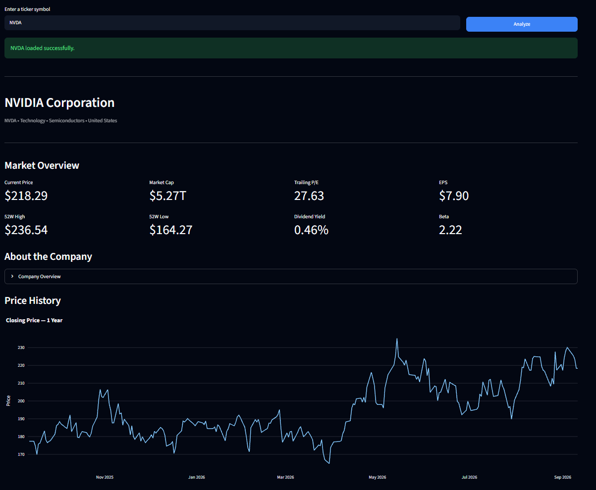
</p>

### 📊 Financial Visualization

Interactive one-year closing-price charts are rendered with Plotly.

<p align="center">
  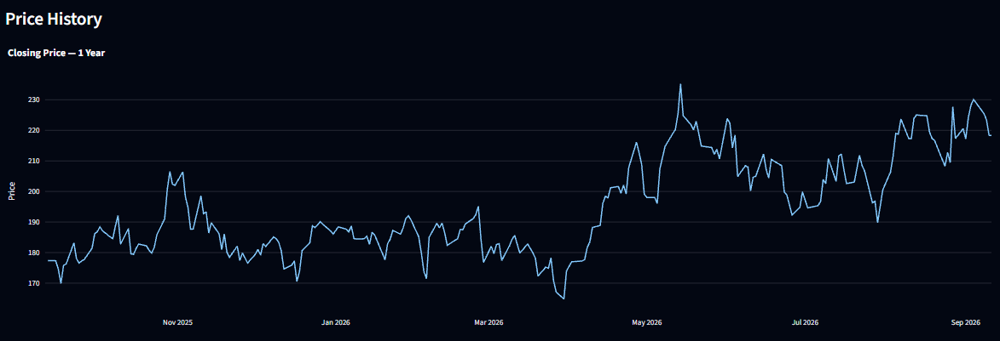
</p>

### 🧮 Deterministic Finance Engine

The local finance engine computes:

- Total assets
- Total liabilities
- Shareholders' equity
- Working capital
- Current ratio
- Debt-to-equity
- Cash ratio
- Equity ratio
- Composite Financial Health Score from 0–100

<p align="center">
  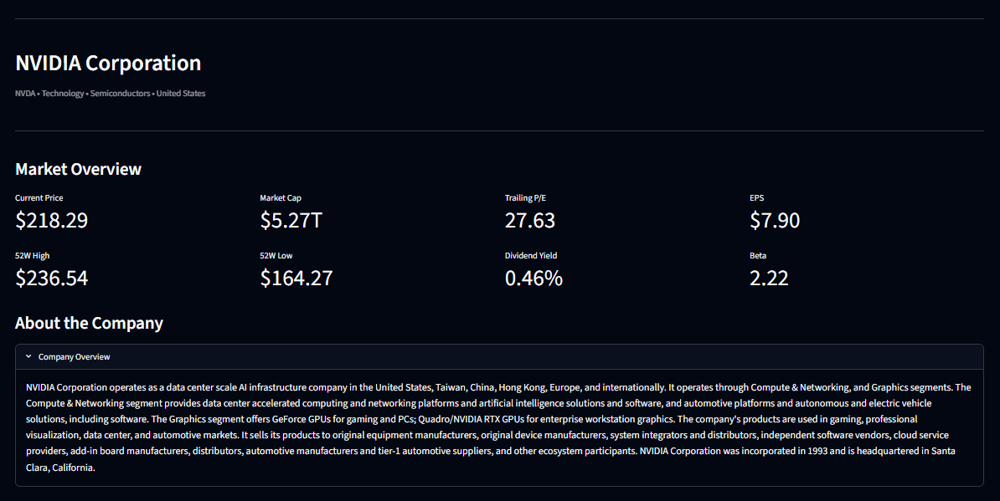
</p>

### 📑 Financial Statements

The application presents a refined **Latest FY summary** first, with complete source tables available through expandable sections.

Supported statements:

```text
Balance Sheet
Income Statement
Cash Flow
```

<p align="center">
  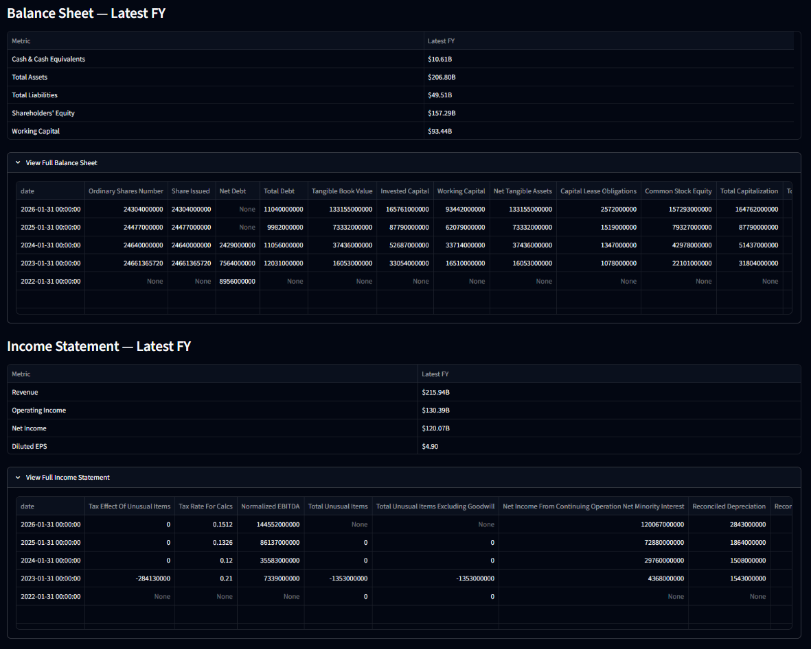
</p>

### 📄 Offline Financial Statement Analysis

Upload supported financial statements for local parsing and deterministic analysis:

```text
CSV
XLSX
XLS
PDF
```

<p align="center">
  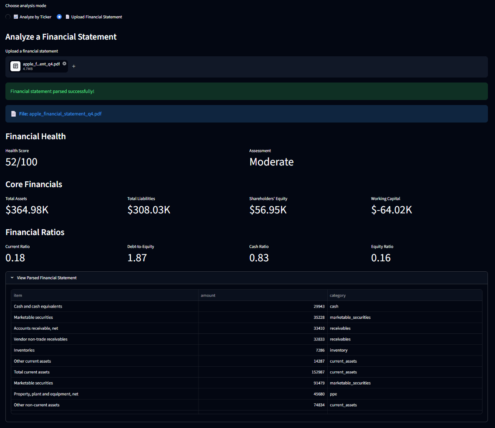
</p>

---

# 🤖 AI Copilot

MoneyMap AI: ReImagined keeps the financial workspace on the left and a permanent AI copilot on the right.

The chatbot can use the currently loaded ticker or uploaded financial statement as its analysis context.

## Supported AI Modes

| Model | Role |
|---|---|
| ⚡ Gemini Flash Lite | Default fast cloud inference |
| 🧠 Gemini Flash | Advanced cloud analysis |
| 💻 Ollama / Llama 3 | Local/offline inference |

### Gemini Flash Lite

<p align="center">
  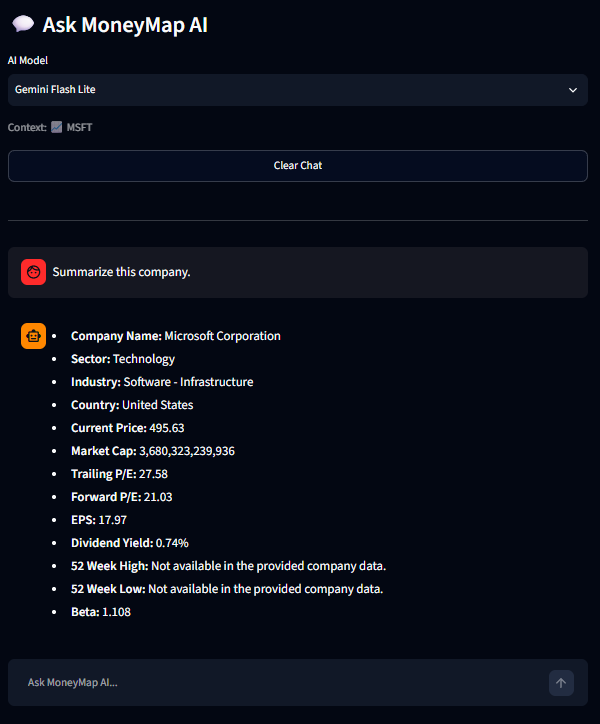
</p>

### Gemini Flash

<p align="center">
  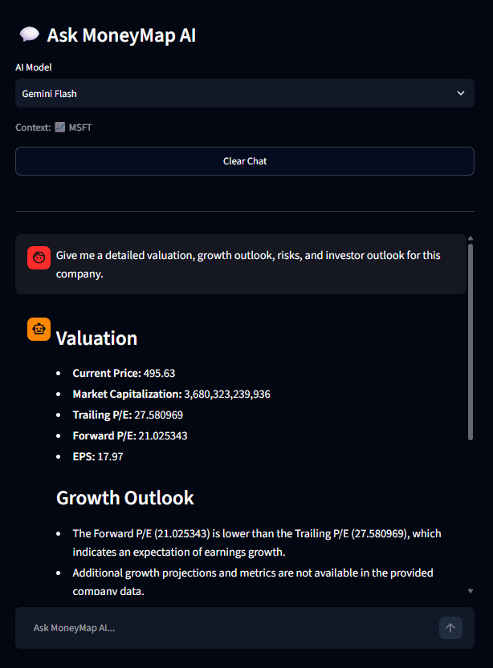
</p>

### Local AI — Ollama

<p align="center">
  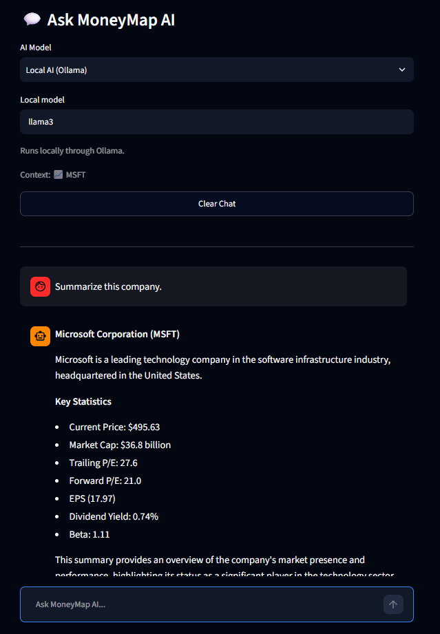
</p>

The release uses **Llama 3** for local benchmarking.

> **Recommendation:** Llama 3 is the reference local model used for the v1.0.0 benchmark. Users on lower-spec hardware can choose another compatible Ollama model such as `llama3.2`.

---

# 🏗️ Architecture

```text
                         ┌─────────────────────────────┐
                         │      MoneyMap AI UI         │
                         │        Streamlit            │
                         └──────────────┬──────────────┘
                                        │
                    ┌───────────────────┴───────────────────┐
                    │                                       │
           ┌────────▼────────┐                     ┌────────▼────────┐
           │ Financial       │                     │ AI Copilot      │
           │ Workspace       │                     │ Chat            │
           └────────┬────────┘                     └────────┬────────┘
                    │                                       │
          ┌─────────┴─────────┐                   ┌─────────┴─────────┐
          │                   │                   │                   │
      ticker.py           parser.py           Gemini              Ollama
          │                   │                   │                   │
      yfinance           CSV/XLSX/PDF       llm_client.py      ollama_client.py
          │                   │                   │                   │
          └──────────┬────────┘                   └─────────┬─────────┘
                     │                                      │
                     ▼                                      │
               finance.py                                   │
           deterministic engine                             │
                     │                                      │
                     └──────────────────┬───────────────────┘
                                        ▼
                                  AI-ready context
```

## Module Responsibilities

```text
main.py              → Streamlit orchestration and application flow
app/ticker.py        → Live company, market, statement and price data
app/parser.py        → CSV/XLSX/PDF financial statement parsing
app/finance.py       → Deterministic financial calculations
app/chat.py          → Gemini prompt construction and AI handling
app/llm_client.py    → Gemini client configuration
app/ollama_client.py → Local Ollama inference
app/components.py    → Reusable Streamlit UI components
app/utils.py         → Formatting and utility helpers
tests/               → Functional tests and performance benchmarks
```

---

# 📊 Performance Benchmarks

All benchmark figures below were measured against the **v1.0.0 release implementation**.
> **Benchmark Note**
>
> All benchmark results in this README were measured on the **v1.0.0 release build** using the author's development environment. Actual latency and performance may vary depending on internet connectivity, Google Gemini API availability, Yahoo Finance response time, local hardware specifications, operating system, Ollama model, and system load.

## ⚡ AI Inference Latency

```text
Gemini Flash Lite   ████                          1.07 s median
Gemini Flash        █████████████████████         11.46 s median
Ollama / Llama 3    ████████████████████████████  17.05 s median
```

| Model | Median | Average | Fastest | Slowest |
|---|---:|---:|---:|---:|
| Gemini Flash Lite | **1.07 s** | 1.15 s | 0.97 s | 1.42 s |
| Gemini Flash | **11.46 s** | 11.79 s | 11.20 s | 12.72 s |
| Ollama / Llama 3 | **17.05 s** | 17.38 s | 12.95 s | 22.15 s |

<p align="center">
  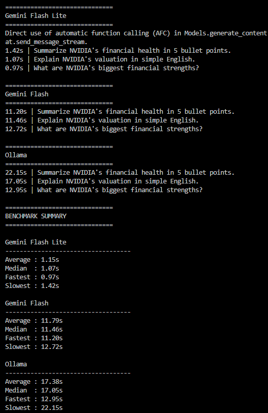
</p>

## 🌍 Global Ticker Benchmark

The ticker engine was benchmarked across **50 publicly listed companies** spanning multiple countries, regions, exchanges, and sectors.

```text
Successful retrieval  ████████████████████  100%
Companies tested      ████████████████████   50
Median fetch latency  ████████████████████  2.30 s
Average fetch latency ████████████████████  2.40 s
```

| Metric | Result |
|---|---:|
| Companies tested | **50** |
| Successful fetches | **50 / 50** |
| Success rate | **100%** |
| Median fetch latency | **2.30 s** |
| Average fetch latency | **2.40 s** |
| Fastest fetch | **1.93 s** |
| Slowest fetch | **3.37 s** |

The benchmark includes listings from markets across North America, Europe, Asia, the Middle East, and Oceania, with US, Indian, Japanese, Korean, Hong Kong, Taiwanese, Dutch, Danish, British, French, German, Swiss, Saudi, Australian, Canadian, Swedish, and Brazilian coverage represented in the test set.

<p align="center">
  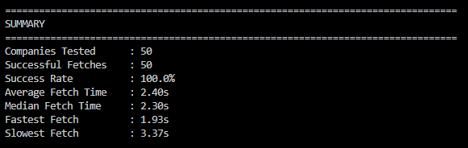
</p>

## 📄 Financial Statement Parsing

```text
CSV    █ 0.03 s
XLSX   █ 0.03 s
PDF    ███████████████████ 1.10 s
```

| Format | Parse Time |
|---|---:|
| CSV | **0.03 s** |
| XLSX | **0.03 s** |
| PDF | **1.10 s** |
| Overall average | **0.39 s** |
| Overall median | **0.03 s** |

## ✂️ Prompt Compression

The benchmark compared a raw fetched financial context with the compact context currently passed into the AI workflow.

```text
Raw context         29,602 characters
Compressed context     310 characters

Reduction            ███████████████████▊ 98.95%
```

**Measured reduction: 98.95%.**

<p align="center">
  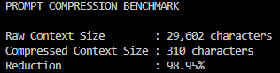
</p>

> This benchmark measures character count rather than token count.

---

# 📁 Project Structure

```text
moneymap-ai/
│
├── app/
│   ├── __init__.py
│   ├── parser.py
│   ├── finance.py
│   ├── ticker.py
│   ├── chat.py
│   ├── llm_client.py
│   ├── ollama_client.py
│   ├── components.py
│   └── utils.py
│
├── tests/
│   ├── __init__.py
│   ├── test_ticker.py
│   ├── test_llm.py
│   ├── benchmark_ai_latency.py
│   ├── benchmark_parser_speed.py
│   ├── benchmark_prompt_compression.py
│   └── benchmark_ticker_speed.py
│
├── assets/
├── data/
├── screenshots/
│
├── .streamlit/
│   └── config.toml
│
├── main.py
├── README.md
├── LICENSE
├── requirements.txt
└── .gitignore
```

---

# 🚀 Getting Started

## 1. Clone the repository

```bash
git clone <YOUR_GITHUB_REPOSITORY_URL>
cd moneymap-ai
```

## 2. Create a virtual environment

### Windows

```powershell
python -m venv .venv
.\.venv\Scripts\activate
```

### macOS / Linux

```bash
python3 -m venv .venv
source .venv/bin/activate
```

## 3. Install dependencies

```bash
pip install -r requirements.txt
```

## 4. Configure Gemini

Create a `.env` file in the **project root**:

```env
GOOGLE_API_KEY=your_google_ai_studio_api_key
OLLAMA_MODEL=llama3
```

`GOOGLE_API_KEY` is required for Gemini Flash Lite and Gemini Flash.

The `.env` file is intentionally excluded from version control.

## 5. Configure Ollama

Install Ollama from:

https://ollama.com/

Verify the installation:

```bash
ollama --version
```

Pull the reference local model:

```bash
ollama pull llama3
```

Verify installed models:

```bash
ollama list
```

Start the Ollama service when necessary:

```bash
ollama serve
```

The application expects the local Ollama API at:

```text
http://localhost:11434
```

> **Recommended:** `llama3` is the local model used for the v1.0.0 benchmark. Users with lower-spec hardware can use a lighter compatible model such as `llama3.2`.

## 6. Run the application

From the project root:

```bash
streamlit run main.py
```

---

# 🧪 Testing

Run tests from the project root.

### Ticker smoke test

```bash
python -m tests.test_ticker
```

### Gemini smoke test

```bash
python -m tests.test_llm
```

### AI latency benchmark

```bash
python -m tests.benchmark_ai_latency
```

### Global ticker benchmark

```bash
python -m tests.benchmark_ticker_speed
```

### Parser benchmark

```bash
python -m tests.benchmark_parser_speed
```

### Prompt compression benchmark

```bash
python -m tests.benchmark_prompt_compression
```

---

# 🔐 Privacy & Data Handling

MoneyMap AI: ReImagined offers two distinct inference paths.

### Cloud AI

Gemini inference sends the relevant financial context to Google's Gemini API.

### Local AI

Ollama performs inference locally through the user's machine, providing a privacy-focused alternative without requiring cloud LLM inference.

Live market data is retrieved through Yahoo Finance via `yfinance`.

Users should avoid sending confidential financial documents to external AI services unless they understand and accept the relevant data-handling implications.

---

# 🧠 AI-Assisted Development

AI tools were used during the development of **MoneyMap AI: ReImagined**.

AI assistance was used for activities including:

- Architecture brainstorming
- Code generation and refactoring
- Debugging
- Prompt design
- Test and benchmark design
- Documentation drafting

The project remained **human-led and iteratively validated**. Code changes were tested against the actual application, functional tests, and performance benchmarks before release.

This project intentionally documents AI assistance rather than presenting AI-generated implementation as independently written without disclosure.

---

# ⚠️ Limitations

- Yahoo Finance data availability and field coverage can vary by ticker and exchange.
- Some financial metrics may be unavailable for specific companies.
- Financial statement structures differ across companies.
- PDF parsing depends on document layout and extraction quality.
- Ollama inference speed depends heavily on local hardware and selected model.
- Benchmark results are environment-dependent release-time measurements.
- Financial analysis is intended for educational and analytical purposes and is not personalized investment advice.

---

# 🗺️ Roadmap

## v1.0.0 — Current Release

- [x] Modular application architecture
- [x] Live ticker engine
- [x] Financial statement parser
- [x] Deterministic finance engine
- [x] Financial Health Score
- [x] Gemini Flash Lite
- [x] Gemini Flash
- [x] Ollama local AI
- [x] Permanent AI copilot
- [x] Interactive market visualization
- [x] Global ticker benchmark
- [x] AI / parser / ticker performance benchmarks
- [x] Release documentation

## Future Ideas

- Structured retrieval over full financial statements
- More intelligent context selection before LLM inference
- Comparative multi-company analysis
- Expanded financial metrics and ratios
- Additional local/cloud model backends
- Richer financial visualizations

---

# 📜 Release

## MoneyMap AI: ReImagined v1.0.0

**First official release of the reimagined project.**

This release represents the transition from the original **MoneyMap AI final-year project** to a modular, portfolio-focused financial AI application.

---

# 👨‍💻 Author

**Atharva Joshi**

B.Tech — Electronics & Telecommunication Engineering, Vishwakarma Institute of Information Technology, Pune

Focus areas:

```text
Python Software Engineering
Generative AI
Agentic AI
Data Science & Analytics
Financial AI Applications
```

---

# 📄 License

This project is licensed under the **MIT License**.

See [`LICENSE`](LICENSE) for details.

**Project Storm • MoneyMap AI - ReImagined**
